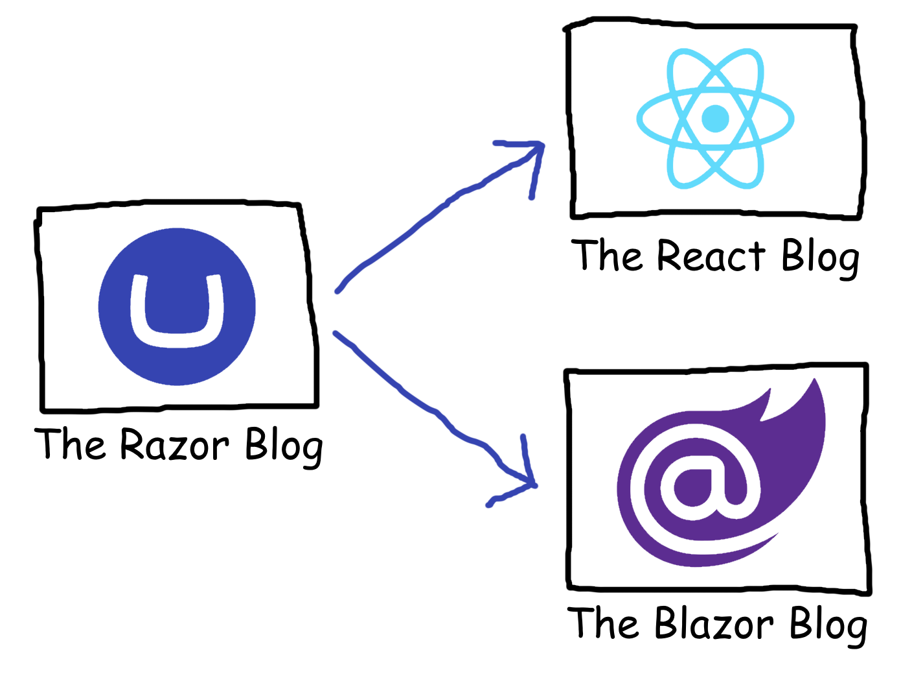

# Application of Delivery API data

This repo contains the sample blog implementations from my talks about "Application of Delivery API data". 

There are three sample implementations:

- The React Blog
- The Blazor Blog
- The Razor Blog

The latter sample acts as a server for the two other samples; in other words, The Razor Blog must run for the other samples to function.

Please note that these are _not_ production grade implementations. They are purely samples that showcase different aspects of how data from the Delivery API can be applied.

## The React Blog

This is a single page application built with [React](https://react.dev/) using [React Router](https://reactrouter.com/).

To try this sample out, run `npm install` and `npm start` in the sample root directory.

Among other things, this sample showcases how to use [custom filters](https://docs.umbraco.com/umbraco-cms/reference/content-delivery-api/extension-api-for-querying#custom-filter) to query blog posts by author and by tag. 

## The Blazor Blog

This sample implements the same blog functionality as The React Blog, using [Blazor](https://dotnet.microsoft.com/en-us/apps/aspnet/web-apps/blazor) as rendering framework.

The sample applies [custom property editors](https://docs.umbraco.com/umbraco-cms/reference/content-delivery-api/custom-property-editors-support) to facilitate related content of posts and authors. This is kind of a workaround that lets us serve related content without having to perform an additional query request. While it works quite fine, please use these kinds of workarounds with caution. Property editor value converters execute at request time, and thus the content querying that goes on might slow down rendering on large datasets.

The sample also reuses one of the custom filters for querying blog posts by tag.

## The Razor Blog

This is first and foremost the Umbraco server that serves blog data to the two other samples through the Delivery API. The Umbraco database is included in this repo, so you should be able to "just" clone the repo and run the site.

The credentials for the backoffice are:

- Email: admin@localhost
- Password: SuperSecret123

...these are also displayed on the login screen :smile:

This is also a Razor implementation of a blog, where Umbraco acts as head of the request. In other words, this showcases how Umbraco can be used as a hybrid CMS, serving data both headlessly to other channels _and_ serving a website on its own.

The sample shows how the Delivery API can be applied to solve various use cases: 

- Building a custom content API, using the Delivery API content rendering service to retain the contract for the returned content items.
- Using the Delivery API querying service to query for content items, reusing the custom filtering built for The React Blog.
